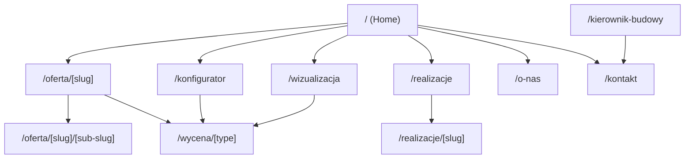
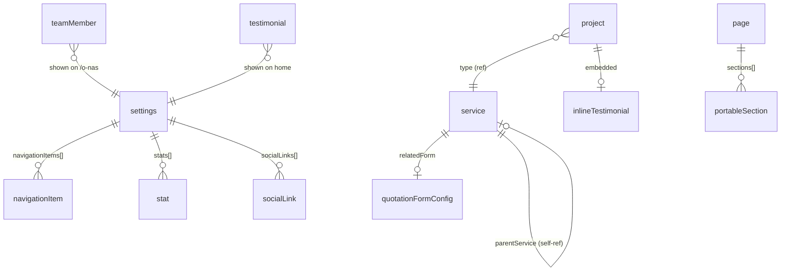
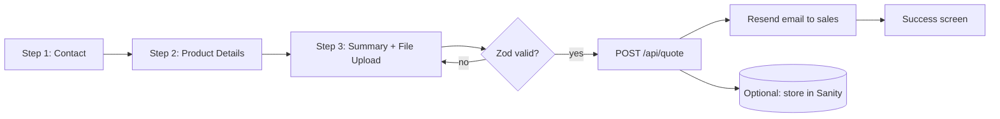
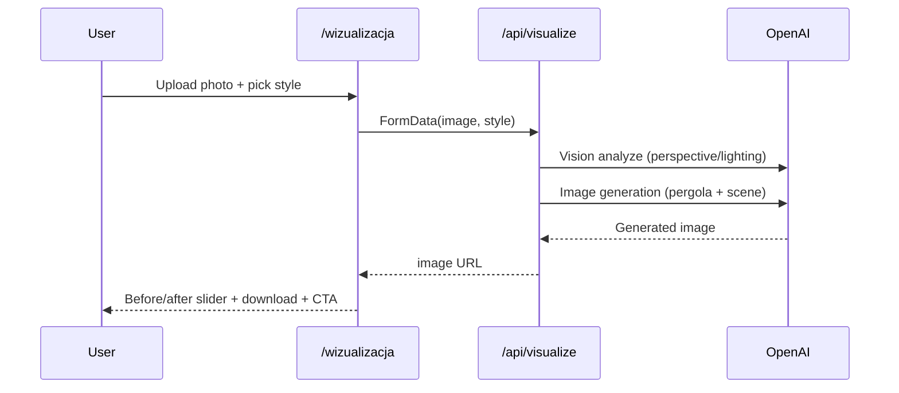
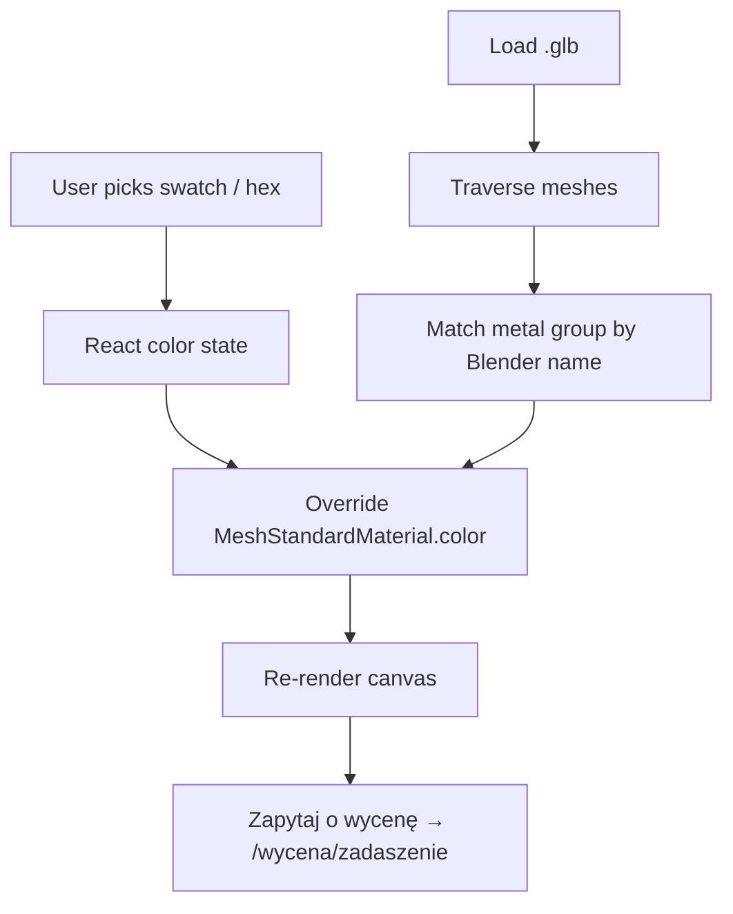

# Complex — Project Overview

> Modern rework of **Complex**, a company specializing in aluminum terrace roofs (zadaszenia), pergolas, composite/wood terraces, and custom outdoor living solutions. Replaces an outdated WordPress site with a dark, architectural, premium experience backed by a headless CMS, a 3D pergola configurator, an AI garden visualizer, and a full lead-generation toolkit.

**Audience for this doc:** developers and the future Claude Code instances working in this repo. All visible website copy is **Polish**; all code identifiers (schemas, components, routes, props) are **English**.

---

## Table of Contents

1. [Stack (reconciled to installed versions)](#stack-reconciled-to-installed-versions)
2. [Users & Goals](#users--goals)
3. [Design System](#design-system)
4. [Information Architecture](#information-architecture)
5. [Navigation](#navigation)
6. [Page Specifications](#page-specifications)
7. [Sanity Content Model](#sanity-content-model)
8. [Key Flows](#key-flows)
9. [Shared UI Components](#shared-ui-components)
10. [API Routes](#api-routes)
11. [Environment Variables](#environment-variables)
12. [Performance & SEO](#performance--seo)
13. [Delivery Phases](#delivery-phases)
14. [Conventions](#conventions)
15. [Reference Links](#reference-links)

---

## Stack (reconciled to installed versions)

> ⚠️ The original spec said *Next.js 15* and *Sanity v3*. The repository is actually on **Next.js 16** and **Sanity v5** — the table below reflects what is installed (`frontend/package.json`, `studio/package.json`). Build against these.

| Layer | Technology | Installed |
|---|---|---|
| Framework | Next.js (App Router) + TypeScript | `next@^16`, `typescript@^5.9` |
| UI runtime | React | `react@^19.2` |
| Styling | Tailwind CSS v4 (config in `frontend/app/globals.css`, **no** `tailwind.config.ts`) | `tailwindcss@^4.3` |
| Headless UI | Ark UI (headless primitives) | _to add_ `@ark-ui/react` |
| Icons (web) | lucide-react (recommended) | _to add_ `lucide-react` |
| Forms | react-hook-form + Zod | _to add_ |
| CMS | Sanity Studio v5 + next-sanity | `sanity@^5.31`, `next-sanity@^13` |
| Live/Visual Editing | `next-sanity` Live Content API + Presentation | installed |
| 3D Configurator | React Three Fiber + drei + three (models from Blender `.glb`) | _to add_ `@react-three/fiber`, `@react-three/drei`, `three` |
| AI Visualization | OpenAI API (vision + image generation) | _to add_ `openai` |
| Transactional email | Resend | _to add_ `resend` |
| Deployment | Vercel | — |
| Image CDN | Sanity CDN + `next/image` | configured (`cdn.sanity.io` allowed in `next.config.ts`) |

**Repo shape:** npm-workspaces monorepo — `frontend/` (Next.js) + `studio/` (Sanity). Schema is authored in `studio/` and consumed in `frontend/` via generated `frontend/sanity.types.ts` (see root `CLAUDE.md` for the TypeGen pipeline). The studio already ships a `settings` singleton (document id `siteSettings`); extend it rather than creating a parallel type.

---

## Users & Goals

| Persona | Needs | Primary conversion |
|---|---|---|
| **Homeowners / property owners** | Visual inspiration, premium feel, easy quoting | Configurator → quotation form |
| **Architects & contractors** | Materials, specs, project references | Realizacje + offer specs |
| **Returning clients** | Contact, follow-up quotes | Kontakt / quotation form |

Business model is **lead generation** (no e-commerce in MVP): quotation submissions, phone CTAs, contact inquiries. Future: Stripe deposits.

---

## Design System

**Mood:** dark, architectural, premium — closer to luxury automotive / high-end architecture than a generic construction brand. Dark mode is the **only** mode (deliberate brand choice; no toggle).

### Color Palette

| Token | Hex | Usage |
|---|---|---|
| `bg-deep` | `#0B0B0C` | Page background |
| `bg-mid` | `#111111` | Section backgrounds |
| `bg-surface` | `#181818` | Cards, panels |
| `accent` | `#4CAF50` (muted alt `#6FCF3A`) | CTAs, highlights, hover, focus |
| `graphite` | `#2A2A2A` | Borders, dividers |
| `silver` | `#9E9E9E` | Secondary text |
| `white` | `#FFFFFF` | Primary typography |

> Green is the inherited brand accent — keep it. It differentiates from competitors who default to blue/gold. Define these as Tailwind v4 `@theme` tokens in `globals.css`.

### Typography

| Role | Font | Notes |
|---|---|---|
| Display / Hero | **Bebas Neue** | Massive headlines, hero titles |
| Headings | **Space Grotesk** | Section & card titles |
| Body | **Inter** | Paragraphs, descriptions |

Load via `next/font/google`, expose as CSS variables (`--font-bebas`, `--font-space-grotesk`, `--font-inter`) and wire into `@theme` (`--font-display`, `--font-heading`, `--font-sans`).

### UI Style

- Glassmorphism panels — backdrop blur, subtle `1px` strokes
- Soft gradient overlays on imagery; photos run edge-to-edge
- Generous whitespace between sections
- Scroll-triggered entrance animations (Framer Motion or CSS)

### Icon System

- **Web UI:** `lucide-react` (consistent thin-line set matching the architectural aesthetic).
- **Sanity Studio:** `@sanity/icons` (already a dependency) — assign one per document/object type (see content model).

| Context | Icon (lucide) |
|---|---|
| Oferta | `LayoutGrid` |
| Formularze wycen | `FileText` |
| Realizacje | `Images` |
| O nas | `Building2` |
| Kierownik budowy | `HardHat` |
| Kontakt | `Phone` |
| Configurator CTA | `Box` / `Boxes` |
| AI visualizer CTA | `Sparkles` |
| Stat: realizacje | `CheckCircle2` |
| Stat: doświadczenie | `CalendarClock` |
| Stat: zadowolenie | `Smile` |

---

## Information Architecture



### Route Map

| Route | Type | Source |
|---|---|---|
| `/` | Static (live) | `settings` + featured `service`/`project`/`testimonial` |
| `/oferta/[slug]` | Dynamic | `service` |
| `/oferta/[slug]/[sub-slug]` | Dynamic (nested) | `service` with `parentService` |
| `/wycena/[type]` | Dynamic | `quotationFormConfig` |
| `/realizacje` | Static (live) | `project[]` |
| `/realizacje/[slug]` | Dynamic | `project` |
| `/o-nas` | Static (live) | `page` (`o-nas`) + `teamMember[]` |
| `/kierownik-budowy` | Static (live) | `page` (`kierownik-budowy`) |
| `/kontakt` | Static (live) | `settings` |
| `/konfigurator` | Client-heavy | static `.glb` assets |
| `/wizualizacja` | Client + API | `/api/visualize` |

---

## Navigation

`NavBar`: transparent at top → blur-on-scroll; collapses to a slide-in drawer on mobile. Nav items are CMS-managed via `settings.navigationItems`.

| # | Item | Behavior | Icon |
|---|---|---|---|
| 1 | **Oferta** | Mega menu | `LayoutGrid` |
| 2 | **Formularze wycen** | Mega menu | `FileText` |
| 3 | **Realizacje** | Link | `Images` |
| 4 | **O nas** | Link | `Building2` |
| 5 | **Kierownik budowy** | Link | `HardHat` |
| 6 | **Kontakt** | Link | `Phone` |

**Oferta** mega menu → Zadaszenia aluminiowe (+ sub-links), Żaluzje tarasowe, Tarasy kompozytowe (+ sub-links), Tarasy z płyt gresowych, Tarasy drewniane, Elewacje kompozytowe, Schody modułowe.

**Formularze wycen** mega menu → Formularz Wyceny Tarasu, Formularz Wyceny Zadaszenia, Formularz Wyceny Żaluzji, Formularz Wyceny Schodów.

---

## Page Specifications

### 1. Home (`/`)

Goal: strong first impression, emotional connection, lead capture.

- **A. Hero** — fullscreen cinematic video/photo (Sanity), dark gradient overlay, animated Bebas Neue headline, Space Grotesk subheadline, three CTAs: **Skonfiguruj pergolę**, **Bezpłatna wycena**, **Zobacz realizacje**; scroll indicator; optional floating glass stat cards.
- **B. Trust / Stats** — animated counters on scroll, from `settings.stats` (e.g. *1200+ montaży*, *15 lat doświadczenia*, *98% zadowolonych klientów*).
- **C. Featured Services** — dark glass cards from `service`; thumbnail, short description, arrow CTA; hover lift + green border.
- **D. 3D Configurator Preview** — teaser *"Skonfiguruj swoją pergolę w 3D"*, embedded mini-configurator (frame color picker), CTA → `/konfigurator`.
- **E. AI Visualizer Teaser** — *"Zobacz jak pergola wygląda w Twoim ogrodzie"*, sample before/after, link → `/wizualizacja`.
- **F. Realizacje Preview** — grid of 6 recent `project`s, filter tags (Residential, Taras, Zadaszenie, Premium), CTA *"Zobacz wszystkie realizacje"*.
- **G. About** — story teaser + craftsmanship imagery, CTA → `/o-nas`.
- **H. Testimonials** — auto-sliding glass cards from `testimonial` (stars, name, quote).
- **I. Lead CTA Banner** — full-width: *"Zaprojektuj swoją przestrzeń na zewnątrz"*, inline form (name, phone, email) or link → `/kontakt`.
- **J. Footer** — logo, nav, contact, social, newsletter, legal (RODO, Polityka prywatności), animated top divider.

### 2. Offer Pages (`/oferta/[slug]`)

Generated from `service`. Hero (name + cover), Portable Text description, gallery, key features/specs, CTA → related quotation form, related `project`s filtered by type. Sub-categories nest at `/oferta/[slug]/[sub-slug]` via `parentService`.

| Polish Name | Slug |
|---|---|
| Zadaszenia aluminiowe | `zadaszenia-aluminiowe` |
| Żaluzje tarasowe | `zaluzje-tarasowe` |
| Tarasy kompozytowe | `tarasy-kompozytowe` |
| Tarasy z płyt gresowych | `tarasy-gresowe` |
| Tarasy drewniane | `tarasy-drewniane` |
| Elewacje kompozytowe | `elewacje-kompozytowe` |
| Schody modułowe | `schody-modulowe` |

### 3. Quotation Forms (`/wycena/[type]`)

Four multi-step forms (react-hook-form + Zod). Field visibility per type is CMS-configurable via `quotationFormConfig`.

| Form | Slug |
|---|---|
| Formularz Wyceny Tarasu | `taras` |
| Formularz Wyceny Zadaszenia | `zadaszenie` |
| Formularz Wyceny Żaluzji | `zaluzje` |
| Formularz Wyceny Schodów | `schody` |

**Shared fields:** full name, phone, email, city / postal code.

**Product-specific fields:**
- *Zadaszenie:* width (m), length (m), roof type (glass / slat / solid / sliding), frame color, features (LED, automation, glass walls), planned install date, budget range.
- *Taras:* surface area (m²), material (composite / gres / wood), color, features.
- *Żaluzje:* window/door dimensions, type (interior / exterior), color.
- *Schody:* number of steps, material, style.

**UX:** 3 steps (Contact → Product Details → Summary) with progress bar, smooth transitions, live Zod validation with inline errors, floating labels + glass inputs, file upload (photos/plans), success screen. Submissions emailed via Resend; optionally stored in Sanity.

### 4. Realizacje (`/realizacje`)

Masonry grid from `project`. Filters: type, material, location. Card: cover, title, short description, location tag. Detail (`/realizacje/[slug]`): lightbox gallery, specs (size, material, duration), optional testimonial, CTA *"Zamów podobny projekt"*.

### 5. O nas (`/o-nas`)

Company story (Portable Text + split imagery), animated milestone timeline, team (`teamMember`), values (Quality, Precision, Innovation, Design, Customer Experience), certifications/partnerships, contact CTA.

### 6. Kierownik budowy (`/kierownik-budowy`)

Service page for the construction-site-manager offering: hero, Portable Text description, "what's included" list, "why it matters" benefits, collapsible FAQ (CMS), CTA *"Skontaktuj się z nami"*.

### 7. Kontakt (`/kontakt`)

Contact details from `settings`, embedded Google Maps, general inquiry form (name, phone, email, message, preferred-contact checkbox, RODO agreement) → Resend, links to specific quotation forms.

### 8. 3D Configurator (`/konfigurator`)

R3F + three. Pergola `.glb` from Blender with named mesh groups (frame/metal, roof panels, accessories).

- **Color picker** for metal frame — preset swatches: Matte Black `#1A1A1A`, Anthracite `#3D3D3D`, White Aluminum `#F0F0F0`, Dark Bronze `#3E2B1E`; optional custom hex.
- Orbit controls (rotate/zoom/pan), smooth camera transitions, animated load.
- Layout: full canvas + floating glass settings panel (swatches, view presets front/side/perspective), CTA *"Zapytaj o wycenę"* → `/wycena/zadaszenie`.
- Implementation: traverse model on load, match metal group by Blender name, override `MeshStandardMaterial.color` via React state. Mobile: simplified (swatches + static render, no orbit).

### 9. AI Garden Visualizer (`/wizualizacja`)

Upload garden photo → AI renders pergola integrated into the scene.

- Flow: upload (JPG/PNG/WEBP ≤ 10MB) → preview → pick style (**Nowoczesna**, **Skandynawska**, **Luksusowa czarna**, **Naturalne drewno**) → **Generuj wizualizację** → animated loading → before/after comparison slider → download → CTA *"Podoba Ci się? Zamów wycenę"* → `/wycena/zadaszenie`.
- Server: `FormData` upload to `/api/visualize`; OpenAI vision model analyzes perspective/lighting, image model generates result; return image URL.
- MVP: one generation per session, no auth. Friendly Polish error messages (unsupported format, too large, API failure).

---

## Sanity Content Model

> Rough draft — field names/types are a starting point, not final. Use `defineType`/`defineField`/`defineArrayMember`, assign an `@sanity/icons` icon per type, and regenerate types after changes. The existing `settings` singleton (id `siteSettings`) is **extended**, not duplicated.

### Relationships



### Document Types

**`settings`** (singleton, id `siteSettings`) — icon `CogIcon`
| Field | Type | Notes |
|---|---|---|
| `siteName` | string | |
| `logo` | image | |
| `contactPhone` / `contactEmail` / `address` | string | |
| `socialLinks` | array → `{platform, url}` | |
| `navigationItems` | array → `{label, href, children[]}` | CMS-managed nav + mega-menu |
| `stats` | array → `{label, value, icon}` | homepage animated counters |
| `ogImage`, `description` | image / blocks | (already present) site metadata |

**`page`** — icon `DocumentIcon` — flexible pages (e.g. `o-nas`, `kierownik-budowy`)
| Field | Type |
|---|---|
| `title` | string |
| `slug` | slug |
| `sections` | array of Portable Text + section objects |
| `seo` | object `{title, description, ogImage}` |

**`service`** — icon `LayoutGrid`/`TagIcon` — offer category
| Field | Type | Notes |
|---|---|---|
| `title` | string | Polish display name |
| `slug` | slug | |
| `coverImage` | image | hotspot |
| `description` | Portable Text | |
| `gallery` | array of image | |
| `features` | array of string | spec bullets |
| `relatedForm` | reference → `quotationFormConfig` | replaces loose `relatedFormSlug` |
| `parentService` | reference → `service` | sub-category nesting |

**`project`** (Realizacja) — icon `ImageIcon`
| Field | Type | Notes |
|---|---|---|
| `title` | string | |
| `slug` | slug | |
| `type` | reference → `service` | |
| `location` | string | |
| `completionDate` | date | |
| `images` | array of image | lightbox gallery |
| `description` | Portable Text | |
| `material` / `size` | string | specs |
| `testimonial` | object `{author, rating, content}` | inline, optional |

**`testimonial`** — icon `CommentIcon`
| Field | Type |
|---|---|
| `clientName` | string |
| `rating` | number (1–5) |
| `content` | text |
| `photo` | image |

**`teamMember`** — icon `UsersIcon`
| Field | Type |
|---|---|
| `name` | string |
| `role` | string |
| `photo` | image |
| `bio` | Portable Text |

**`quotationFormConfig`** — icon `DocumentsIcon` — drives `/wycena/[type]`
| Field | Type | Notes |
|---|---|---|
| `formType` | slug | `taras` / `zadaszenie` / `zaluzje` / `schody` |
| `title` | string | Polish label |
| `fields` | array → `{key, label, fieldType, required, options[]}` | CMS-configurable visibility |

> **Note:** the spec used both `quotationForm` and `quotationFormConfig`; standardized on **`quotationFormConfig`**. The actual Zod schemas/validation live in code; this type only controls labels and which optional fields are shown.

### Studio Structure

Singletons (`settings`) pinned as single items; collections (`service`, `project`, `testimonial`, `teamMember`, `page`, `quotationFormConfig`) as document lists. Configure Presentation `mainDocuments`/`locations` for the routes above so Visual Editing click-to-edit works (the current `sanity.config.ts` still references the removed demo `post`/`page` resolvers — replace them).

---

## Key Flows

### Quotation Form (multi-step)



### AI Garden Visualizer



### 3D Configurator



---

## Shared UI Components

Ark UI headless primitives styled with Tailwind v4.

| Component | Purpose |
|---|---|
| `GlassCard` | Backdrop-blur card with subtle border |
| `HeroSection` | Full-bleed media + overlay + animated title |
| `SectionWrapper` | Consistent padding + max-width container |
| `Button` | Primary (green), secondary (ghost), tertiary (text) |
| `NavBar` | Transparent → blur on scroll, mobile drawer |
| `MegaMenu` | Dropdown for Oferta & Formularze wycen |
| `QuotationForm` | Multi-step shared layout + per-type fields |
| `ProjectCard` | Masonry card for Realizacje |
| `TestimonialSlider` | Auto-sliding glass testimonial cards |
| `ComparisonSlider` | Before/after image reveal |
| `ColorSwatch` | Color picker for the configurator |
| `ThreeDViewer` | R3F canvas wrapper |

**Responsive:** desktop-first, fully mobile-usable; mega menu → drawer; configurator simplified on mobile; Tailwind default breakpoints (`sm`–`2xl`).

---

## API Routes

| Route | Method | Purpose |
|---|---|---|
| `/api/quote` | POST | Validate + email quotation submissions (Resend), optional Sanity write |
| `/api/contact` | POST | Contact form → Resend |
| `/api/visualize` | POST | Image upload → OpenAI → generated image URL |
| `/api/draft-mode/enable` | GET | Existing — Presentation/Visual Editing draft mode |

Keep all secrets (OpenAI, Resend, Sanity write token) server-side only.

---

## Environment Variables

```bash
# Sanity (public)
NEXT_PUBLIC_SANITY_PROJECT_ID=
NEXT_PUBLIC_SANITY_DATASET=
NEXT_PUBLIC_SANITY_API_VERSION=        # optional
NEXT_PUBLIC_SANITY_STUDIO_URL=         # optional

# Sanity (server)
SANITY_API_READ_TOKEN=                 # existing read token (drafts/live)
SANITY_API_WRITE_TOKEN=                # if storing form submissions

# Integrations (server only)
OPENAI_API_KEY=
RESEND_API_KEY=

# Site
NEXT_PUBLIC_SITE_URL=
```

> The original spec listed `SANITY_API_TOKEN`; the repo uses **`SANITY_API_READ_TOKEN`**. Add a separate write token only if persisting submissions to Sanity.

---

## Performance & SEO

- App Router with live/SSR content; Sanity fetched via `sanityFetch` (Live Content API) — prefer over ad-hoc `client.fetch`.
- `next/image` everywhere (lazy, WebP); `cdn.sanity.io` already allowlisted.
- Per-page Metadata API (title, description, OG image) sourced from Sanity.
- `lang="pl"` on `<html>`, semantic HTML.
- Sitemap via `app/sitemap.ts` (a minimal one already exists — extend to enumerate services/projects/pages).

---

## Delivery Phases

| Phase | Scope |
|---|---|
| **1 — Foundation** | Next + Tailwind v4 tokens + Ark UI; Sanity schemas; NavBar/Footer/MegaMenu; design tokens |
| **2 — Core Pages** | Home, Oferta (dynamic), Realizacje, O nas, Kierownik budowy, Kontakt |
| **3 — Forms** | 4 quotation forms (RHF + Zod), Resend submission, success/error states |
| **4 — 3D Configurator** | Blender `.glb` export, R3F integration, metal color picker, `/konfigurator` |
| **5 — AI Visualizer** | `/api/visualize`, OpenAI integration, comparison slider, `/wizualizacja` |
| **6 — Polish & Launch** | SEO metadata, Lighthouse, cross-browser, CMS handoff walkthrough, Vercel deploy |

---

## Conventions

- **Copy** is Polish; **code** (schemas, components, routes, props, API paths) is English.
- Studio UI in English with **clear Polish field labels** for the client.
- **Dark mode only** — no theme toggle.
- After any schema or GROQ change, regenerate types (`cd frontend && npm run sanity:typegen`).
- Visual references: `Complex_Prototype.md` and v0 prototype screenshots per component/nav.
- Do **not** add Claude as co-author to commit messages.

---

## Reference Links

**Frameworks & libraries**
- Next.js (App Router): https://nextjs.org/docs — and read local docs in `node_modules/next/dist/docs/` before Next.js work
- Tailwind CSS v4: https://tailwindcss.com/docs
- Ark UI: https://ark-ui.com/docs
- lucide-react: https://lucide.dev/icons
- react-hook-form: https://react-hook-form.com/get-started — Zod: https://zod.dev
- React Three Fiber: https://r3f.docs.pmnd.rs — drei: https://drei.docs.pmnd.rs — three.js: https://threejs.org/docs

**CMS**
- Sanity docs: https://www.sanity.io/docs — `@sanity/icons`: https://icons.sanity.build/all
- next-sanity: https://github.com/sanity-io/next-sanity — Live Content API: https://www.sanity.io/live
- Presentation / Visual Editing: https://www.sanity.io/docs/presentation

**Integrations**
- OpenAI API: https://platform.openai.com/docs
- Resend: https://resend.com/docs
- Vercel deploy: https://vercel.com/docs
